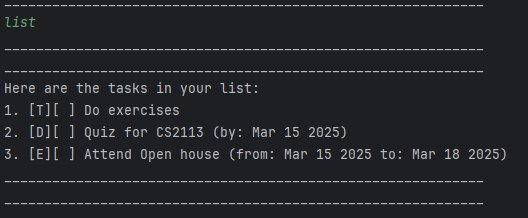

# Mimon User Guide




Mimon is a simple, user-friendly task manager that helps you organize and manage your tasks directly from the command line. You can add tasks, set deadlines, mark them as completed, and keep track of your daily activities. Below, you’ll find a guide to using Mimon’s key features.

---

## Adding Deadlines

The **Deadline** feature allows you to add tasks that must be completed by a certain date. When you add a deadline, the program will save the task along with the specified due date.

### Usage:

`deadline <task_description> /by <date>`

### Example:

Example: `deadline Submit report /by 01/03/2026`

The task "Submit report" will be added with the deadline specified as **01/03/2025**.
```
Got it. I've added this task:
  [D][ ] Submit report (by: Mar 01 2025)
Now you have 4 tasks in the list.
```

## Adding ToDo Tasks

The **ToDo** feature allows you to add tasks that don't have any specific deadline. These tasks are simple and can be added as reminders.

### Usage:

`todo <task_description>`

## Example
Example: `todo Buy groceries`

The task "Buy groceries" will be added without a specific deadline.
```
Got it. I've added this task:
 [T][ ] Buy groceries 
 Now you have 1 tasks in the list.
```

## Adding Event Tasks

The **Event** feature allows you to add tasks that span a period, specifying a start and end time.

### Usage:

`event <task_description> /from <start_time> /to <end_time>`

### Example:
Example: `event Team meeting /from 10/03/2025 10:00 /to 12/03/2025 12:00`

The task "Team meeting" will be added, specifying the start and end times.
```
Got it. I've added this task:
 [E][ ] Team meeting (from: 2025-03-10 10:00 to: 2025-03-10 12:00) 
 Now you have 1 tasks in the list.
```
---
## Listing Tasks

You can list all the tasks you've added to Mimon. This feature helps you see all your tasks and their current status (completed or not).

### Usage:

`list`

### Expected Outcome:
All tasks will be listed with their status and task type. For example: 
```
Here are the tasks in your list:
[T][ ] Buy groceries
[D][ ] Submit report (by: 2025-03-01)
[E][ ] Team meeting (from: 2025-03-10 10:00 to: 2025-03-10 12:00)
```
---

## Marking Tasks as Done

You can mark any task as completed using this feature. Simply specify the task number to mark it as done.

### Usage:

Example: `mark <task_number>`

### Example:
`mark 1`

The task will be marked as completed, and the task status will change to **done**.

```Nice! I've marked this task as done: [T][X] Buy groceries```


---

## Marking Tasks as Not Done

If you made a mistake or need to change the task's status, you can unmark it.

### Usage:

Example: `unmark <task_number>`

### Example:
`unmark 1`


### Expected Outcome:
The task will be marked as not completed, and the task status will change back to **not done**.

```OK, I've marked this task as not done yet: [T][ ] Buy groceries```

---

## Exiting the Program

When you're done, you can exit Mimon with a simple command.

### Usage:

`bye`

### Expected Outcome:
Mimon will say goodbye and close the program.

```Bye. Hope to see you again soon!```

---

---

## Listing Tasks by Date

The **List by Date** feature allows you to filter and view tasks that are scheduled for a specific date. The command supports multiple date formats and can filter both **Deadline** and **Event** tasks based on the given date.

### Usage:

`list-date <date>`

### Example:
Example: `list-date 01/03/2025`

The tasks scheduled for **01/03/2025** will be listed.
```
Tasks on 01 Mar 2025:

[D][ ] Submit report (by: 2025-03-01)
```

### Supported Date Formats:
- `dd/MM/yyyy` (e.g., 01/03/2025)
- `d/M/yyyy` (e.g., 1/3/2025)

---

## Finding Tasks by Keyword

The **Find** feature allows you to search for tasks based on a keyword. The command will return all tasks that contain the specified keyword in their description. The search is case-insensitive.

### Usage:

`find <keyword>`

### Example:
Example: `find report`

All tasks containing the keyword "report" will be displayed.

```
Here are the matching tasks in your list:

[D][ ] Submit report (by: 2025-03-01)
```
---
## Deleting Tasks

The **Delete** feature allows you to remove a task from the list permanently. You just need to specify the task number, and it will be deleted.

### Usage:

`delete <task_number>`

### Example:
Example: `delete 1`


### Expected Outcome:
The task at position **1** will be deleted from the list.

```Noted. I've removed this task: [T][ ] Buy groceries Now you have 2 tasks in the list.```

---